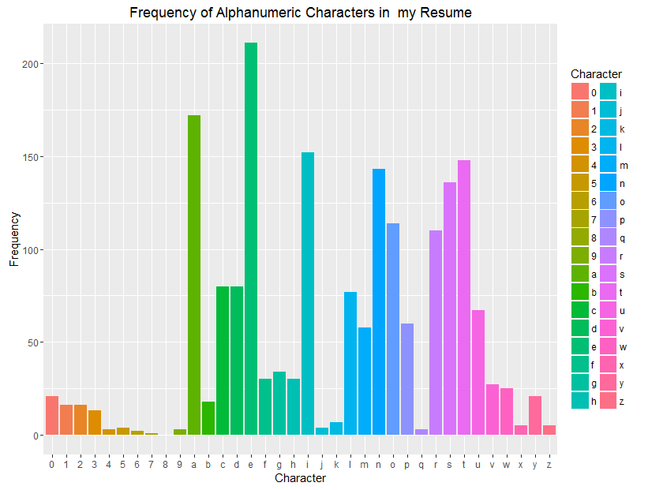

Here we look at the frequency of alphanumeric characters in a plain text formatted resume. I copied and pasted my MS Word resume into a Notepad (.txt) format. No changes were made. 

```r
library(stringr)
library(ggplot2)
filename = "resumetext.txt"
raw_text = readLines(filename) ##This gives a 45-length vector of my resume, i.e. my resume was 45 lines long in plain text format

concate = paste(raw_text, sep='', collapse = '')##Concantates the vector into one line
##We can also use the str_c function

only_alpha = gsub("[^[:alnum:]]", "", concate)##Removing anything but alpha-numeric characters

nums = c("1", "2", "3", "4", "5", "6", "7", "8", "9", "0")##Vector of numbers
Frequency = str_count(str_to_lower(only_alpha), c(letters, nums))##counting the number of each letter and numbers, str_to_lower converts everything to lowercase

h = data.frame(Character = c(letters, nums), Frequency = Frequency)##GGplot is weird in how it requies its data so this just converts the data into a neccessary dataframe

##making a visually appealing plot
ggplot(data=h, aes(x=Character, y=Frequency, fill=Character)) + 
  geom_bar(stat="identity") + ggtitle("Frequency of Alphanumeric Characters in  my Resume")
```


