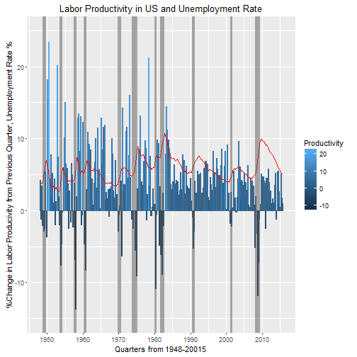

Here we look at the quarterly non-farm labor productivity in America since 1948 and compare it to the quarterly non-farm unemployment rate. Both data sets are from the Bureau of Labor Statistics. The labor productivity is the percent change from the previous quarter. Here we look at the quarterly non-farm labor productivity in America since 1948 and compare it to the quarterly non-farm unemployment rate. Both data sets are from the Bureau of Labor Statistics. The labor productivity is the percent change from the previous quarter. I could not get the API pulldown to work so I exported the data into Excel and preprocessed the data a bit (change the format) to make it more compatible with R.

```
## Warning: Stacking not well defined when ymin != 0
```


Understandbly, there is a sharp decrease in labor productivity during a recession. What is interesting is the gradual depression (i.e. decrease) of the change in productivity. In other words, pre-computer age there were large increases in labor productivity greater than 10%, sometimes more than 20%. In more recent times, change in labor productivity has been no more and has hovered around 5% since the Great Recession. My theory is the shift of manufactering jobs from Stateside to oversees. I am assuming the main driver in productivity is manufacting. What drives increases in productivity is newer technology and/or better utilization of resources. But as the labor force in America has shifted to inside an office and sitting at a desk there is only so much one can do to make the average office worker more productive. 


