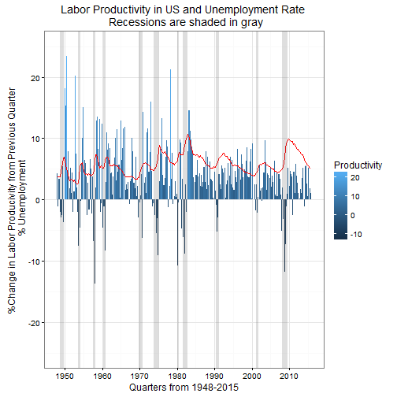

Here we look at the quarterly non-farm labor producivity in America since 1948 and compare it to the quarterly non-farm unemployment rate. Both data sets are from the Beuru of Labor Statistics. The labor productivity is the percent change from the previous quarter. 

```
## Warning: Stacking not well defined when ymin != 0
```


